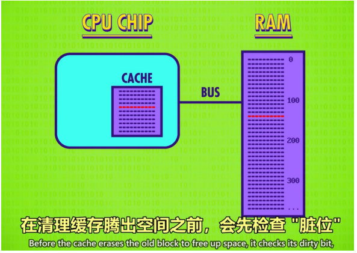

# 计算机科学速成课

**电子计算机元器件的发展：继电器->真空管-> 晶体管**

**计算机为什么只能存储，处理二进制的数据？**

1. 计算机的元器件晶体管只有两种状态：通电（1）和断电（0），用二进制可直接通过元器件的状态来s设计计算机
2. 而且数学中的布尔代数分支可用“Ture”和“False”（1代表Ture，0代表False）进行逻辑判断，代替实数进行运算
3. 计算的状态越多，信号越容易混淆，影响计算。对于当时每秒运算百万次以上的晶体管，出现信号混淆是最让人头疼的。
   
**布尔代数**

- 两个值Ture和False（以前学的代数有无限的取值：3.33，1032，$\sqrt{2}$）
- 四种操作有与a（and）,或（or），非（not），异或（xor）(以前学的代数有加，减，乘，除)
1. 非操作，有一个输入一个输出，把输入的布尔值反转。使用晶体管实现非操作，实现了非操作的带你路叫做非门。（之所以叫门，是因为他能控制电流的路径）
2. 与操作，有两个输入一个输出，仅当输入都伟Ture，输出才为Ture，只要有输入有False，输出就为False。
3. 或操作，有两个输入一个输出，只要输入有Ture，输出就为Ture，仅当输入都为False，输出才为False
4. 异或操作，有两个输入一个输出，仅当一个输入为Ture，一个输入为False输出才为Ture，若两个输入相同（都为Ture或都False。

**抽象**

抽象，就是从宏观，高层角度看问题/东西，不管细节。（对立面就是具体）这里可以用简单的符号代替具体的复杂的电路

**计算机如何存储和表达数字？**

十进制和二进制的区别？

- 十进制有十个数字，0~9，逢10进1（不存在10这个数字），每向左进一位，数字大十倍，使用第i位的权重为下，则第i+1位的权重为10x，第0位的权重为1.
- 二进制有两个数字，0~1，逢2进1（不纯在2这个数字）,则每向左进一位，数字大2倍，所以第i位权重为x，第i+1位权重为2x，第0位的权重为0.
- 注意:对于同一个数，可以表示/书写为十进制或二进制，只是表示方法不同，但表示的是同一个数。比如183个苹果，用十进制表示为183，用二进制表示为1011011，虽然表示方式不同，但是都是代表183这个数。

二进制的加法

十进制的假发是逢10进1，二进制的加法是逢2进1。

单位换算

1个二进制位称位1比特（bit）（为什么叫bit，没有为什么，只是一个规定称呼而已，更容易表达，比如你要说三个二进制位，有了这个称呼，就只需要说3bit，字数就变少了）

8bit=1byte（B）

1KB=2^10B=1024B(并不是一千，比一千多一点)

1MB=2^20B（比一百万多一点）

1GB=2^30B(比十亿多一点)

billion(十亿) million（百万） thousand（千）

正负整数、浮点数的表示

- 32位整数，用左边第31位表示正负，0正1负，用剩下31位表示数字
- 32位浮点数，即小数，计算机使用IEEE754标准来表示。比如625.9先写成0.6259*10^3,这里有两个重要的信息，一个是有效位数6259，一个指数3（决定小数点的位置，故要存储），让后标准规定32位浮点数用最左边1位存储正负，接下来8位存储指数，剩下的存储有效位数
  
字符的表示

**用数字给字符编号**，比如ASCll编码中，字符'('编号位数字40，计算机遇到40时，查ASCll编码表就会在屏幕上显示一个'('字符。

除了可显示字符，还有一些控制字符，比如换行编号为10，计算机遇到10，查ASCll编码表知道这是一个控制字符，就会将屏幕上的光标换行。

UNICODE，统一所有字符编码的标准

世界上存在着许多编码方式，同一个二进制数字可以被解释成不同的符号。因此，想要打开一个文本文件，就必须知道它的编码方式，否则用错误的编码方式解读，就会出现乱码。为什么电子邮件常常出现乱码？就是因为收件人和收信人使用的编码方式不同。

可以想象，如果有一种编码，将世界上所有的符号纳入其中。每一个符号给予一个独一无二的编码，你们乱码问题就会解决。这就是Unicode。

Unicode当然是一个很大的集合，现在的规模可以容纳100多万个符号。每一个符号的编码都不一样，比如，U+0639表示阿拉伯字母Ain，U+0041表示英文的大写字母A，U+4E25表示汉字严。

**算数逻辑运算**

什么是算术逻辑运算

- 命名：简称ALU，Arithmetic&Logic Unit
- 组成：ALU有两个单元，一个算术单元和一个逻辑单元（Arithmetic和Logic Unit）
- 作用：计算机中负责运算的组件，处理算术/逻辑运算的最基本单元。
- 实现：通过与门，或门，非门，异或门进行设计和组合，从而实现个中国能够进行加减乘除，与或非的电路。

溢出的概念

- 内容：在有限的空间内，无法存储位数过大的数，则称为溢出。
- 说明：第7位的进位如果为1，则无法存储，此时容易引发错误，所以应该尽量避免溢出。

ALU的抽象

寄存器与内存

ALU(算数逻辑单元)是计算机内部执行算数逻辑运算的部件，**计算出了结果，还要把结果存储起来。**

当玩游戏、写文档时如果断电，进度会丢失，这是为什么？原因是这是计算机使用的RAM（随机存取存储器），俗称内存，内存只能在通电的情况下存储数据，断电时，内存中的数据就会丢失。

锁存器是利用与、或、非逻辑门实现的是带你路/器件，可以存储bit。然后，通过组合多个锁存器，形成距阵，在通过组合多个距阵，制成内存，使得能够存储更多的bit。寄存器和内存一样都是通过组合锁存器实现的，都只能在通电的情况下存储数据，不同点是寄存器存储的bit比较少，通常是32位（4B）、64位，而内存一般可以达到4GB（1GB=2^30B=八百多万B），8GB或更大，另外，寄存器位于CPU内部，内存位于CPU外部。

**内存的基本/最小存储单位是byte（8bit）**，我们需要对每个byte编号，这样才能读写特定的byte，这样的编号称为地址（如，读地址为7的那个byte，或将10010110写到地址为12的那个byte中）

内存的一个重要特点就是可以随时访问内存中的任何位置/地址，故叫随机存储器。

中央处理器（CPU，Central Processing Unit）

CPU,负责执行指令，可抽象地认为由存储器，控制单元，ALU，时钟组成。

指令，指示CPU做某些事情，如指示CPU做算术逻辑运算、指示CPU读写内存。注意，指令本质上还是0101的数据

时钟，负责管理CPU运行的节奏，以准确的时间间隔，触发电信号，控制单元用这个电信号，推动CPU的内部操作。

CPU的工作过程：不断地取指->解码->执行。

寄存器位于CPU内部，内存位于CPU外部，CPU和内存通过地址线（CPU告诉内存读写那个地址）、数据线（CPU将要写如内存的数据通过数据线传递给内存，或悲惨将CPU要读的数据通过数据线传递给CPU）、允许读/写控制线（CPU读内存时，打开允许读控制线，这样才知道CPU要进行内存操作，CPU写内存时，打开允许写控制线，这样内存才知道CPU要进行写内存操作）进行数据交换。

指令和程序

程序/软件就是人为设计的一系列指令和数据的集合，一个程序实现了某些功能。

视频中给出的例子是一个求余数的程序。

**现代CPU如何提升性能**

缓存

缓存是CPU内部的小块RAM。相对于每次直接读写内存，可以把数据放在缓存中，因为缓存在CPU内部，读写数据就更快，从而CPU不同等太久，从而提高CPU性能。

缓存命中：CPU想要的数据已经在缓存中。

缓存未命中：CPU想要的数据未在缓存中。

缓存和RAM不一致：缓存中的数据来源于RAM，如果修改了缓存中的数据，而没有更新RAM中对应的数据，此时缓存和RAM不一致。

缓存同步：将缓存中被修改的数据更新到RAM，从而解决缓存和RAM不一致的问题的过程，叫做缓存同步。一啊不能缓存中每一份数据有一个脏位，如果缓存中来自内存的数据被修改了，脏位置为1，之后CPU在清除缓存时，检查到某份数据的脏位为1，就知道数据被修改了，就会把该数据更新回RAM，使得缓存于RAM数据一致

指令流水线

指令流水线指充分利用CPU内部的各个部件，并运行下这些部件来执行指令。

指令流水线技术存在一些问题，如果不解决就会导致程序执行结果出现错误。不过放心，现代CPU有一些解决方法，能够在使用指令流水线技术提高效率的同时，确保程序的正常执行

同时运行多个指令流

多核CPU，多CPU（超级计算机）

编程语言发展史

伪代码：用自然语言（中文，英文）对程序的高层描述，称为伪代码。

汇编语言：汇编指令的集合，一条汇编指令对应一条机器指令，只是0101这样的机器指令的助记符。

汇编器：一个程序，将汇编程序转换为机器指令程序。（记住，计算机只能识别二进制的机器指令）

高级语言：更高层的抽象，不需要过多考虑把数据放到哪个寄存器，哪个内存地址这些细节。

编译器：一个程序，将更高级语言写成的程序转换为低级语言程序。

变量：在高级语言中，一个变量代表内存中一个可以存储数据的单元。

**语句和函数**

就像自然语言（中文，英文）一样，编程语言也有语句。

就像自然语言有语法一样，编程语言的语句也要符合编程语言规定的语法

赋值语句

下面是一个赋值语句，将5这个数存储到变量a中。

分支语句

满足某个条件表达式，才执行某个分支的代码。

循环语句

只要满足条件表达式，就重复执行循环体内的代码。

函数

函数打包了一块实现某个功能的代码，提供了更高层的抽象，使用函数的人只需要知道以恶搞函数的功能，输入和输出，通过调用函数就能实现对应的功能，而不需要了解函数内部是如何实现的。

下面是一个实现求幂（函数的功能）的函数，函数名为EXPONENT，该函数的输入是两个参数，一个底数一个指数，输出是求幂的结果（函数的输入输出）

库

现代编程语言，往往配套一个库。

库就是预先写好的函数集合，可以直接拿来用。

算法

算法就是解决问题的一系列步骤。

同一个问题可以使用不同的算法解决。如排序有很多算法，但效率有好有坏。

算法的时间复杂度可认为是以恶搞数学函数，输入是算法的输入规模，输出是算法的运行时间。

数据结构

数据结构是计算机存储，组织数据的方式。

数组：一段连续的存储空间。通过下标来访问数组中的元素。下标从0开始，下标1处的元素是数组的第二个元素。

字符串：元素为字符的数组。

结构体：将多个变量打包在一起。

指针：指针是一个特殊的变量，它存储的是一个内存地址。**指针A指向B**的意思是，指针A存储了变量B的地址，可以通过指针A访问变量B。

链表：连起来的节点。

队列：符合先进先出（FIFO）的操作规则的链表叫做队列。

栈：符合后进先出（LIFO）的操作规则的链表叫做栈。

树，图......

存储器

内存是易失性的，存储器是非易失性的，在断电时，诗句也不会丢失。

机械硬盘，有多个磁盘和机械部件组成，读写速度慢。

固态硬盘，SDD，读写速度快一点，但交割相对机械硬盘也更高。

内存层次结构，越往下，价格越便宜，存储容量更大，读写速度越慢。

